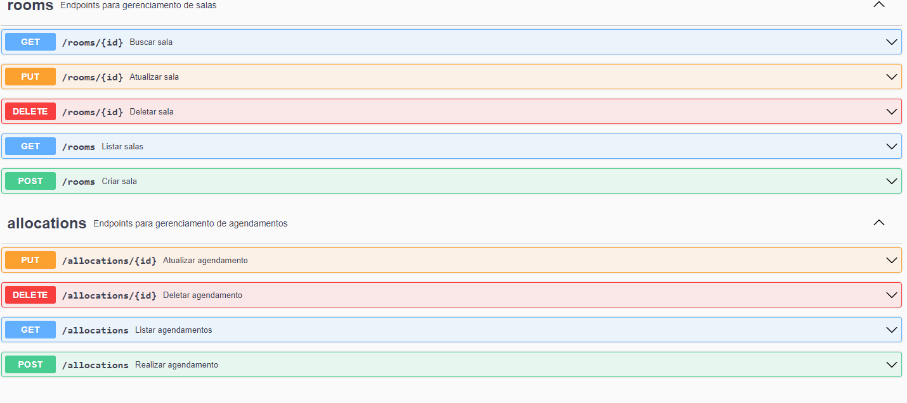

# Realmeet


### Realmeet é uma API REST para reservas e gerenciamento de salas de reunião.

### 🟠 Objetivo do Projeto

Esse é um projeto de Back-end, cujo o principal objetivo é realizar reserva e gerenciamento de salas de reunião, de maneira rápida e flexível.

### 🟠 Resolva os seguintes problemas

✔ Dificuldade de encontrar uma sala disponível;

✔ Alta burocracia para reservar uma sala de reunião ;

✔  Elemine o incômodo de gerenciar manualmente a reserva;

### 🟠 Principais tecnologias/ferramentas utilizadas

- Java 11
- Spring Boot
- Spring MVC
- Spring Data
- Maven
- Swagger | OpenApi
- MapStruct
- JUnit 5
- Mockito
- Flywaydb
- Docker
- MySQL


### 🟠 Pré-requisitos

- JDK 11
- Maven 3.x.x
- Docker e Docker Compose
### 🟠 Rodando o projeto
```bash
# Clone este repositório
$ git clone https://github.com/victorsimiao/realmet.git

# Utilizando Docker
$  docker-compose up -d

# O servidor iniciará na porta:8080

#  Autenticando os endpoints com API key
Para ultilizar os recursos dessa API, é preciso adicionar o seguinte no Header da Request: 

$ api-key : key-customer

```
### 🟠 Rodando os testes
```bash
$ mvn test
```
### 🟠 Documentação
```bash
$ http://localhost:8080/v1/swagger-ui/index.html
```


### 🟠 Desenvolvedor
[Victor Simião](https://www.linkedin.com/in/victorsreis/) 🚀